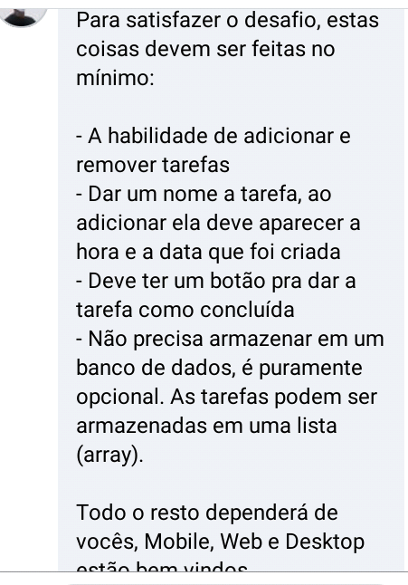
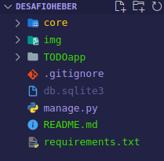
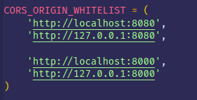

# API for a ToDo list app

### O que é ?

 - Esta é uma API para um aplicativo(web/mobile) de Todo list(" lista de Afazeres") 

### Porquê fez isso ?

 - For um desafio proposto lá no facebook por um amigo "***HÉBER JÚLIO***"
  

### O que a API faz ?

 - Ela disponibliza o *CRUD* para ás tarefas.

 Satisfazendo todos os requisistos do desafio.
 

## Usando a API

> Requisitos 

 *  python ==^3.9
 *  venv
 *  django==3.2.6
 + django-cors-headers==3.8.0
 + djangorestframework==3.12.4

> Primeiros passos
 
 - _Clonar_ o projecto em sua máquina

 -  Acessar a pasta do projecto em sua máquina e abir o prijecto no *terminal* ou *prompt/powerShell*

 - Crie um ambiente para as dependencias dos projecto com o **venv** usando o seguinte comando:
 
    > <code> python -m venv venv</code>

 Será criada uma pasta dentro do nosso projecto com o nome "venv"
 - De seguida precisamos habilitar o nosso ambiente, usando o seguinte comando

    > <code> source venv/bin/activate </code> 

 **OBS:** *Se estiver a usar o windows powerShell ou CMD* o comando é ligeramente diferente, use o seguinte comando:
    > <code> </code>
  
Com o abinte pronto, podemos agora instalar as dependencias do projecto, que estão delaradas no ficheiro ***requirements.txt*** usando o seguinte comando

   > <code> pip install -r requirements.txt </code>

Após a finalização da instalação das depêncencias, a estrutura do teu projecto estara assim:

Provalmente, você está notando a ausência do ficheiro *db.sqlite* no seu projecto "lol" :) relaxa, vamos criar ele jaja.

 - Ainda no terminal/prompt digite

    > <code>python manage.py migrate</code>

Esse comando irá executar as migrations do nosso projecto...(Caso você não esteja familiarizado com o Django, entenda isso, como se o comando acima vai procurar em nosso projecto se existe alguma necessidade de banco de dados, se for encontrada a necessidade ele ira subir de forma autoamatica, gerando assim a base de dados necessaria para tal)

### Rotas da API

**OBS** Eu criei a API pensando em usar no Frontend o *Vuejs*, logo habilitei no **cors_header** a url do *localhost*do vuejs padrão. Se você vai usar um outro framework para consumir a API. Certificasse de que você vai delarar a *url* desse framework em 

 > core/settings.py

  

> Rotas disponiveis

 - Todas as Routas do CRUD(*CREATE,READ,UPDATE,DELETE*)

> Acessar as Routas

  - As routas estão protegiadas com uma atutenticação bem básica, logo para poder acessar as  routas, você vai precisar de um usuário com permissão para tal.

  > Criando o Usuário para poder usar a API
  No terminal digite: 
      
      <code>python manage.py createsuperuser</code>

      - digite um nome para seu usuário
      - ditige seu email
      - digite uma senha
      - redigite a senha, para confirmar
      E pronto, usuário CRIADO <3

  Agora para Finalizar é so acessar a routa padrão da API

  > http://localhost:8000/task/
  
  
  ou

  > http://127.0.0.1:8000/task/  

  E divertir-se <3

### Quer contribuir para o projecto ?

 -  Sinta-se livre para contribui para que esse projecto melhore :)

____________________
#### Qualquer dúvida chama-me la nos minhas redes sociais :)

**Edgar A. Dikeng**